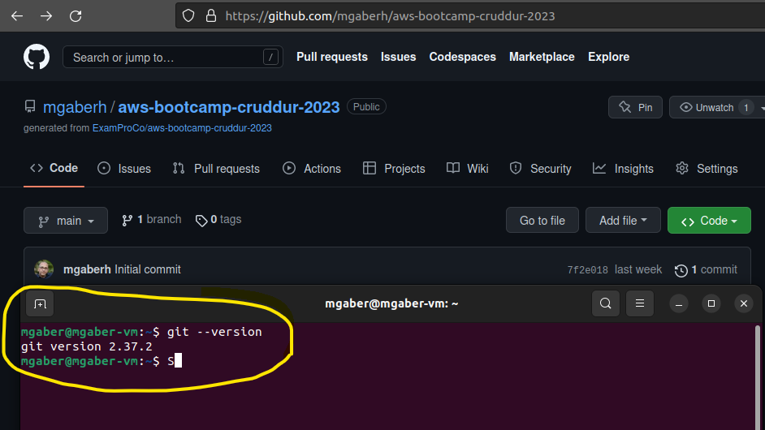
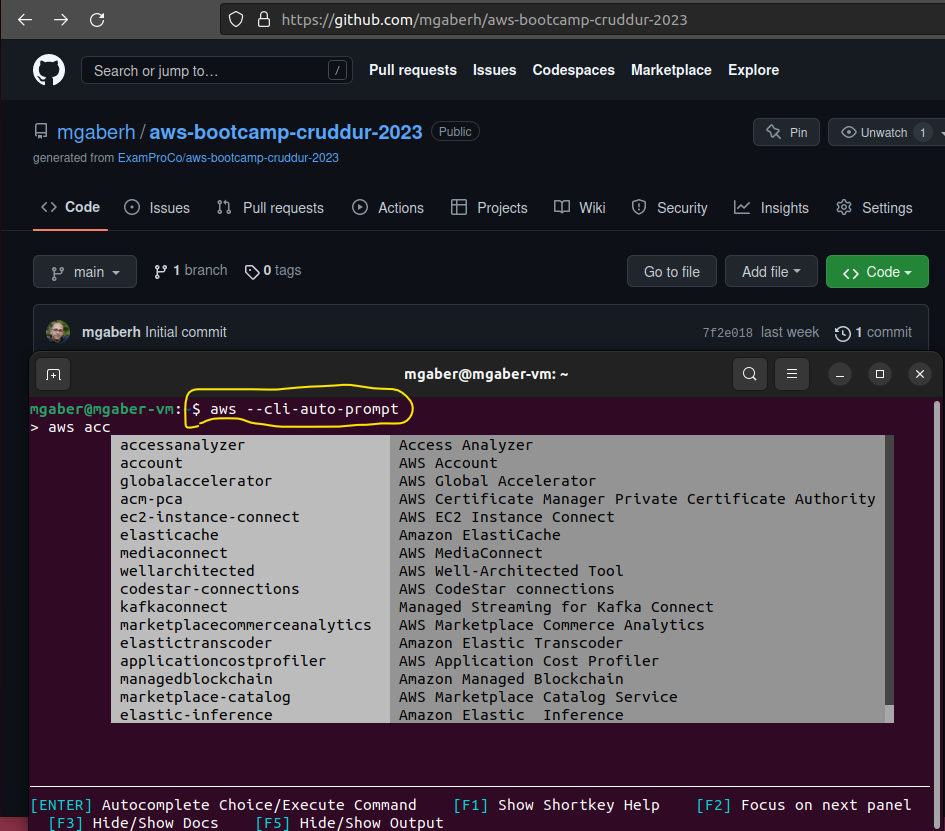
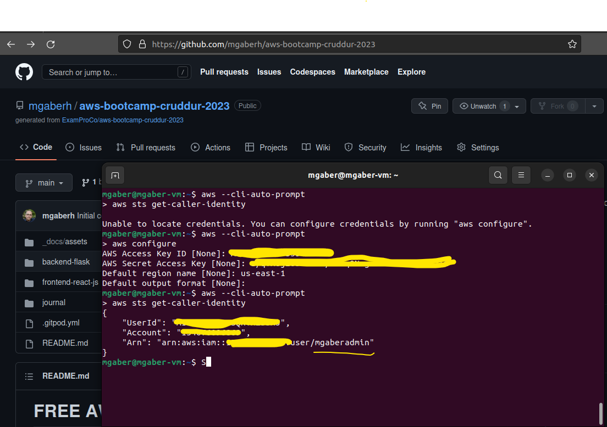

# Week 0 — Billing and Architecture
## Required Homework/Tasks
I decided to use a local enviroment with Linux 22.10(64)
### Install and Verify git
  <li>check git exist by $ git --version </li>
  <li>install git by command sudo $ apt-get install git</li>
  <li>configur git login by 
	$ git config --global user.name "yourusername" 
	$ git config --global user.email "email@youremail.com"</li>
  <li>check git exist by $ git --version </li>
   
  
  
  
###  Install and Verify AWS CLI

<li>check aws exist by $ aws --version </li>
<li>install awscli version 2 : </li>
curl "https://awscli.amazonaws.com/awscli-exe-linux-x86_64.zip" -o "awscliv2.zip"  
unzip awscliv2.zip 
sudo ./aws/install
<li>check aws exist by $ aws --version </li>
 

<li>verify using aws with cli auto prompt </li>
 

 
 
###  Configur and Verify AWS access and secrit keys
 

